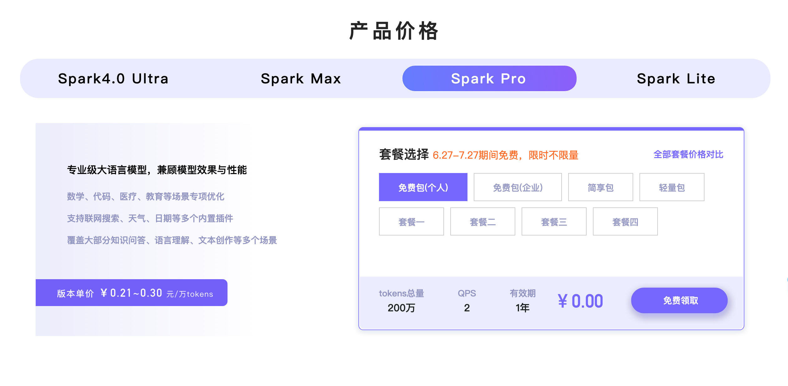
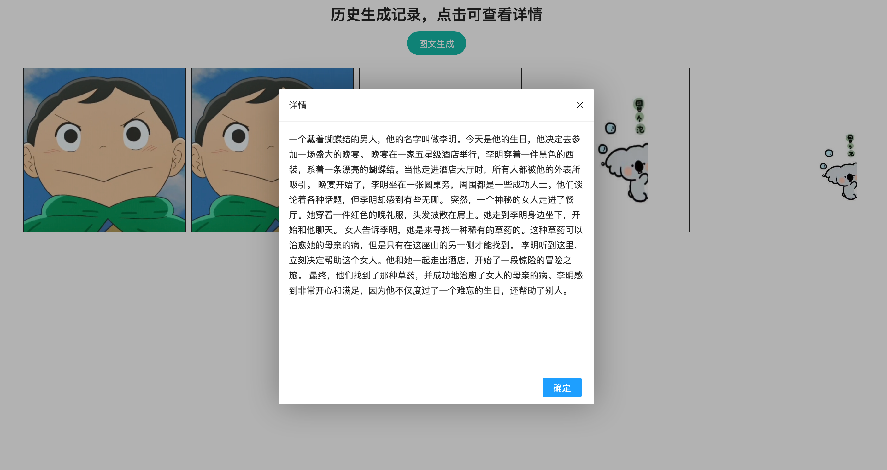
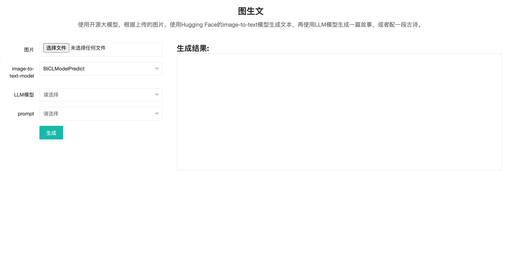
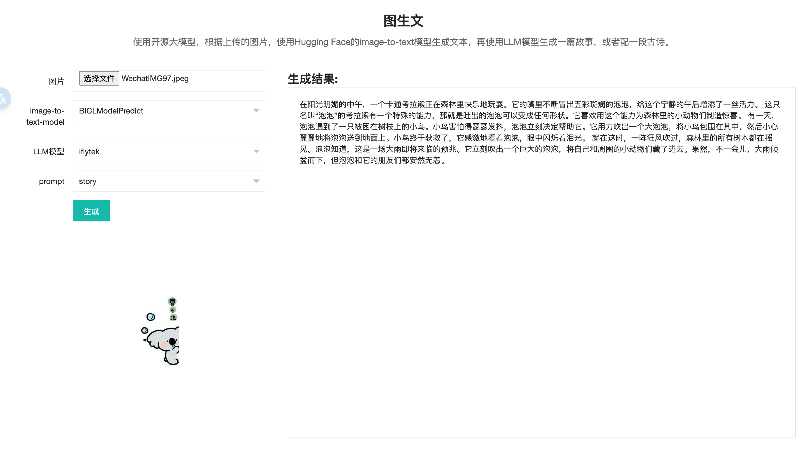

# ImageToTextProject

## 项目介绍

本项目基于Hugging Face的`transformers`库，实现了图片到文本的任务。

### 安装依赖

```shell
# python version == 3.11.2
pip install -r requirements.txt -i https://pypi.tuna.tsinghua.edu.cn/simple
```

### 模型下载

- 文件比较大，如果失败请多尝试，或者单独把模型下载到本地
- 文档<https://hf-mirror.com/>

```shell
# linux or mac 设置环境变量
export HF_ENDPOINT=https://hf-mirror.com

# windows cmd 设置环境变量
set HF_ENDPOINT=https://hf-mirror.com
# Windows Powershell
$env:HF_ENDPOINT="https://hf-mirror.com"

# 下载模型
# 地址https://hf-mirror.com/Salesforce/blip-image-captioning-large/tree/main

cd predict_model

huggingface-cli download --resume-download  --local-dir-use-symlinks False Salesforce/blip-image-captioning-large --local-dir models/blip-image-captioning-large

```

### LLM 配置

#### 添加环境变量

```shell
cp .env.example .env
```

> 目前支持讯飞、chatgpt

- xunfei

> 讯飞开放平台账号、APPID、APIKey、API_SECRET 具体可参考[讯飞开放平台](https://www.xfyun.cn/)
> 目前讯飞提供了免费token，可申请试用，有效期为一年，参考这个介绍[讯飞api](https://xinghuo.xfyun.cn/sparkapi)
> 需要实名认证，几分钟就可以认证好了




### 运行项目

```shell
python manage.py makemigrations
python manage.py migrate
python manage.py runserver
```

### 运行截图






